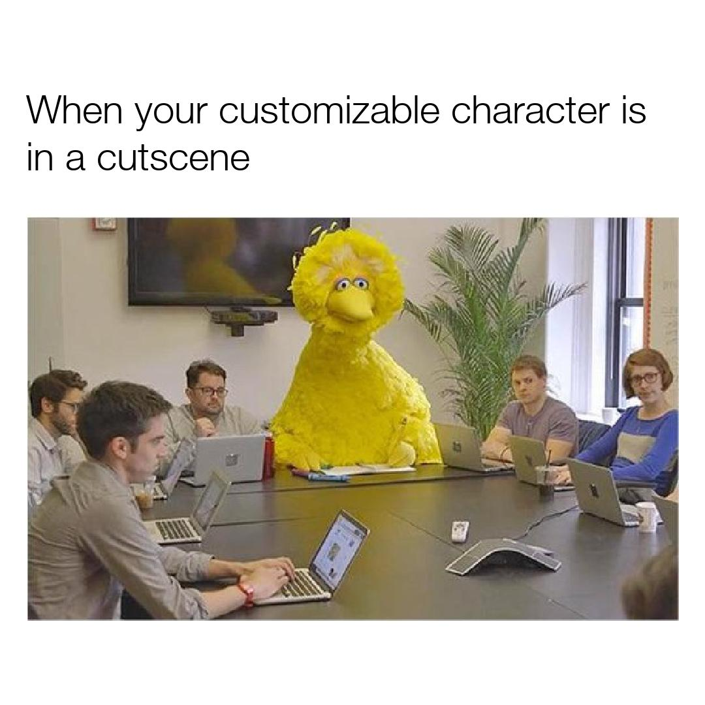
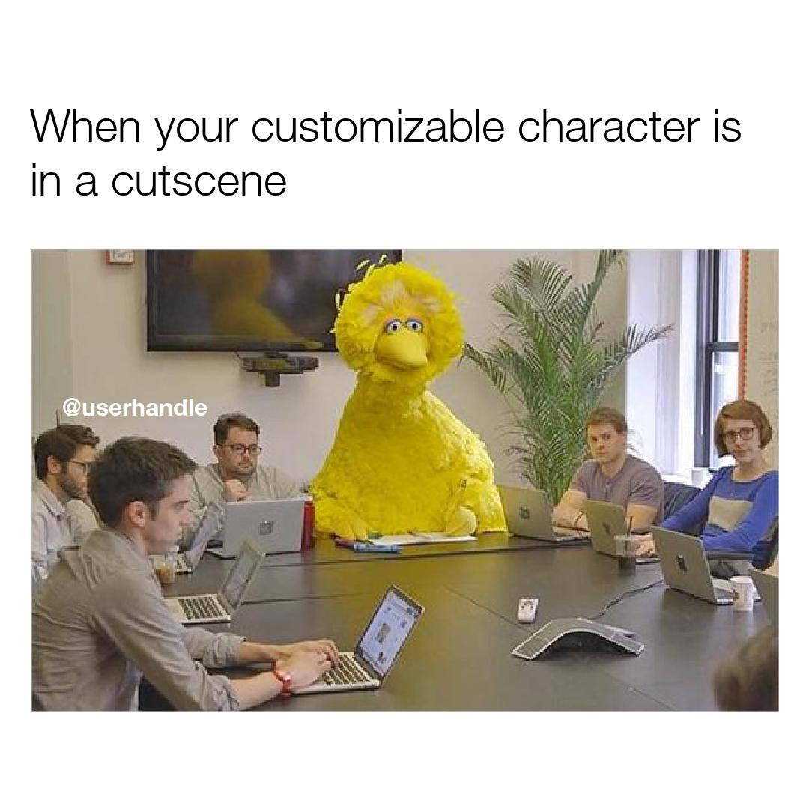

# watermarker

The goal of this project is to automate the process of adding a simple watermark to an image.

## Motivation

The sharing of images on social media platforms has become notorious for the recycling of content amongst their users. If a user has posted an image that has gained popularity, other users will see the success of the image and post it to their own account in hopes of attracting more followers. This is usually done without credit to the original user. 

To retain some of the credit, the original poster may add a watermark to their image: 


Adding a watermark to an image involves the straightforward task of adding text to an image, which can be done in most image editors. 

Suppose we had a large bank of photos that we would like to watermark, then it could take quite some time to copy and paste the text on to each new image in an editor. 

## Getting Started

Clone:
```git clone https://github.com/evmarts/watermarker.git```

Run the script:
```python watermarker.py```

### Prerequisites

- Python

## Built With

* Python Imaging Library (PIL)

* Python textwrap module

## Examples

Suppose we have the following images we would like to watermark with our usersname, *@userhandle*:



After placing the images of the text in the ```in/``` directory, we can run the script:

~~~
evmarts$ python watermarker.py
Enter watermark text: @userhandle
Enter a location to place the watermark on the image: (1-9)
  locations: 
  1 | 2 | 3 
 ----------- 
  4 | 5 | 6 
 ----------- 
  7 | 8 | 9 
4
Watermark added to meme0.jpg
Watermark added to meme1.jpg
Watermark added to meme2.jpg
Watermark added to meme3.jpg
Watermark added to meme4.jpg
Watermark added to meme5.jpg

~~~

The program looks at the dimension of an input image and uses PIL to paste a watermark in the user-specified location. The watermarked images are then stored in the ```out/``` directory:




## Authors

Evan Martin

